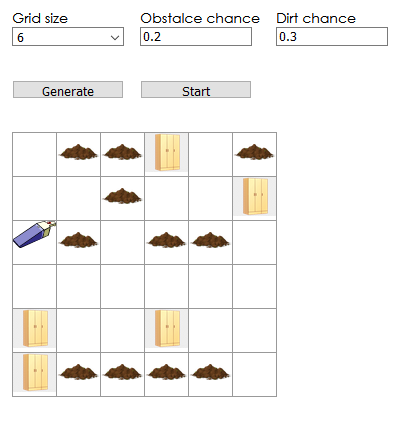

<h2>Introduction</h2>

I was reading _Artificial Intelligence: A Modern Approach_, an introductory book
about the field of AI and its fundamentals and reached a certain programming exercise
which I then tried to solve.

<h2>The exercise</h2>

The exercise asked to design an environment in which a hypothetical smart
vacuum cleaner operates. The environment is a simple grid, with each cell
either containing dirt, obstacles or nothing. The vacuum cleaner must then
roam the grid and clean the dirt as good as possible (with as little moves
as possible cleaning all dirt etc).

Finally, the cleaner must return to its starting cell.

<h2>My attempt?</h2>

I struggled to come up with a solution that acts like a **real** AI (i.e
makes decisions based on _precepts_). But I thought it would still be fun
to program the environment and solve it in any way.

I realized that an (N \* N) grid (or any grid really) can be thought of as a graph.
Each cell is a node that is connected to its four adjacent nodes (top, down, left, right).

<h2>My solution</h2>

I implemented a simple depth-first search algorithm with the above realization in mind.
And then for fun I visualized the solution on an HTML page using React, which was NOT the tool
for the job but was fun nonetheless.

<h2>Implementation</h2>

The UI is simple. The obstacle chance specifics the chance of a random cell containing a wardrobe.
The dirt chance similarity does the same but for dirt and size is for grid size.

Clicking start will run the vacuum cleaner through the space.

Try it out [hereeeeee!](https://naughty-cray-5f6239.netlify.app/)
