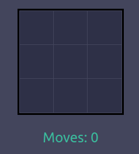

<h2>Introduction</h2>

I ran into this one puzzle game while playing a video game on my PC. It was part
of a hidden room where you had to solve it to unlock the door leading to a boss fight.

Upon first glance I had known it could be solved algorithmically, so I had decided
to take some time off the game and try and write a program to do it for me. Unfortunately,
after some thirty minutes of trying, I had not managed to come up with an algorithm to solve it
and had proceeded to solve it manually.

Two days ago, however, I was reading about a class of problems called "single-state problems".
The aforementioned puzzle seemed to fit the definition of single-state problems and now,
armed with new-found knowledge, I decided I will give it another try.

<h2>The puzzle</h2>

The puzzle is deceptively simple: you are presented with a 3x3 grid of blue tiles.
Each time you click on one of the tiles, the tile and all adjacent tiles (top, bottom, left, right)
change color to red. If the tiles are already red, they are toggled back to blue.

The goal of the puzzle is to turn all tiles to red, having unlimited number of clicks.

<h2>Coming up with a solution</h2>

I quickly realized something I had missed the first time around: clicking the same tile twice
is completely meaningless in a solution. All it does is negate the effect of clicking it the first time
and therefore a proper solution would never involve clicking the same tile twice.

I then thought of the problem like:

- For my first move, I can choose one of 9 tiles...
- Then for my second move, the first tile is now off limits so 8 options...

I am sure you see where this is going. An exhaustive search solution in the order of
$O(n!)$. Obviously this was very dumb as the order in which you click the tiles in does not matter.

Which brings us to my second attempt. I thought about each tile as a decision, it is either clicked or not clicked.
This greatly reduces the search complexity to an order of $O(2^n)$. Exploiting symmetry and noticing that each solution has a mirror image,
We can cut the solutions in half and end with a complexity of $O(2^{n-1})$.

However, there remains the problem of actually confirming the solution once its found. I came up with a simple way to check the correctness
of solutions:

- Represent the tiles in a bit-array, 1 means clicked, 0 not clicked.
- Traverse every tile in whatever order you like.
- At each tile, add up the 1's in the tile plus the 1's in its adjacent squares.
- Take that sum and apply modulo 2

Now if the answer to that operation is 0 you know your solution is wrong, as a lit tile should
either be toggled once, three times, five times, etc to be still on. A tile that is toggled in the multiples of
two will be off as the clicks cancel each other.

<h2>Implementation</h2>

I decided yet again to implement this but with a bit more care and code organization this time.
It worked out well and seems to be bug-free. You can check out my implementation [here!](https://optimistic-albattani-bd07e0.netlify.app/).

<h2>Further reading</h2>

Turns out the game has a name (Lights out) and there exists an elegant generalized solution using linear algebra (it can solve the game from ANY state that is solvable).
You can read more about the theory behind it [here!](https://www.xarg.org/2018/07/lightsout-solution-using-linear-algebra/).
