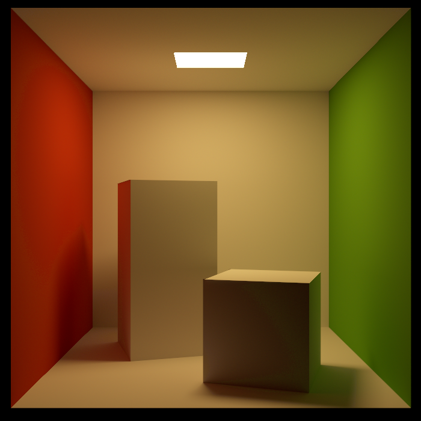
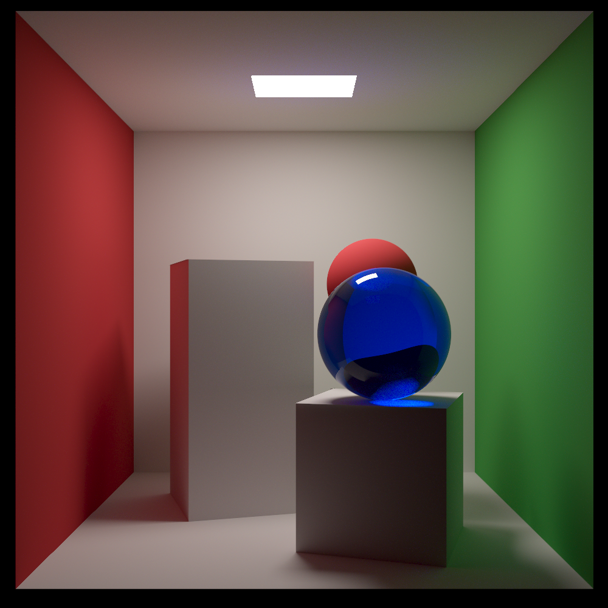

<h2>Introduction</h2>

A few months ago I ordered a physical copy of [Physically Based Rendering: From Theory to Implementation](https://www.pbr-book.org/) and got to reading (more like working through?). I decided to implement a minimalist example that incoporates some of the main techniques. Mainly, I wanted to implement uni-directional path tracing, entirely in the compute shader.

<h2>Results</h2>

I took the data provided by Cornell for the famous Cornell Box image and fed it to my renderer, this was the result:

I was pleased with the result. One thing to note is that despite using exactly the spectral data they provided, I could not get it to look like their result. In fact, theirs looks quite different. I suspect there is something missing like a post-processing step or maybe their renderer back then was not quite as accurate, who knows.

I then decided to add a glass sphere just to test caustics and dielectrics. This was the result:

I was also very happy with this result. I must note it converges very very quickly and you get the above image in less than 10 seconds. A lot more time needs to be spent to remove the remaining noise in the caustics however.

You can find the entire source code here: [github](https://github.com/Meryx/ComputeRayTracer)
