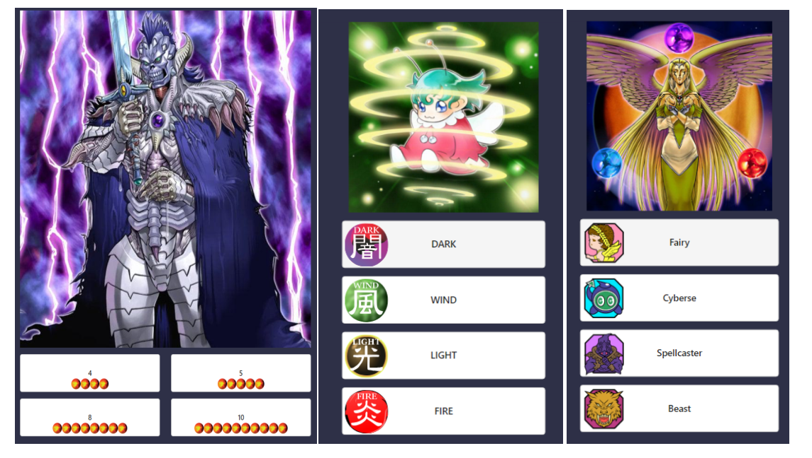

<h2>Introduction</h2>

I've been playing some old Yu-Gi-Oh! games on a PSP emulator. In these games, there are quiz minigames that ask you random questions about cards in the game. For example, it would show you a picture of a card (say: "Dark Magician") and present you with three different choices:

- ATK 1950
- ATK 2500
- ATK 700

And you would have to pick the correct ATK value for "Dark Magician" within a small time frame. I quite enjoyed these minigames so I decided to recreate them with the entire set of available Yu-Gi-Oh! cards (as of January 2024).

<h2>Acquiring all the cards</h2>

For starters, I needed to find an (image, information) pair for every single card in the game and compile them. Fortunately, there exists a free API that allows you to pull any card in the game by name and get a cropped image or whatever detail about the card you want, such as its ATK, DEF, level, name, effect, etc.

[Link to the API](https://ygoprodeck.com/api-guide/)

So first, I wrote a script that pulls the names of every single card in the game. After that, the script pulls an image/information pair (separately) and stores them in a local directory. I stored the information for every image an identically named .json file. This took quite a bit because I had to thorttle my pulling to 20 requests/second because the API asks you to not exceed this limit.

The script is [here](https://github.com/Meryx/yugioh-download-images) if you're interested in downloading all the images yourself.

<h2>Developing the game</h2>

I thought I would need to do some image manipulation at the start because I had intended to pull the full images and then crop the parts where the question is concerned. Therefore, I went with Python for the backend, anticipating I would need OpenCV or something to modify the images. However, later realizing that there are cropped images provided by the API, I did not need python. But I went with it anyways because why not.

For the frontend I just did a simple React based frontend. The backend would pull random images from the directory, create a random question based on either the ATK, DEF, name, level, type, or attribute and then send the question and 4 choices to the frontend.

The frontend has the icons for the types and attributes and level etc and then would display the choices alongside the correct icons. The user is then able to click on any of the choices and it would trigger another fetch request for the next question.

[Backend github](https://github.com/Meryx/yugioh-quiz-backend)

[Frontend github](https://github.com/Meryx/yugioh-quiz-frontend)

<h2>Deployment</h2>

After finishing the game locally I decided to go one step further and deploy it. I decided to use AWS to learn something new and have some fun with it.

For the images, I uploaded all of them to an S3 container and connected my django backend to the container. Now its local but it pulls from the S3 container.

For the backend I created an EC2 container and instantiated it there. I also setup gunicorn and nginx and enabled https. I acquired the domain names ygoquiz.com and ygoquizapi.com for the frontend and backend respectively and pointed them to the IP addresses of my projects.

For the frontend I just deployed it to vercel

So after 40 soemthing hours and $40 later I had the game deployed... for 6 hours.
See, AWS sent me a warning that I was about to run out of free-tier usage and I immediately shut my EC2 and S3 instances down. Oh well, my friends got to try it for a few hours before it went down!

Some pictures

