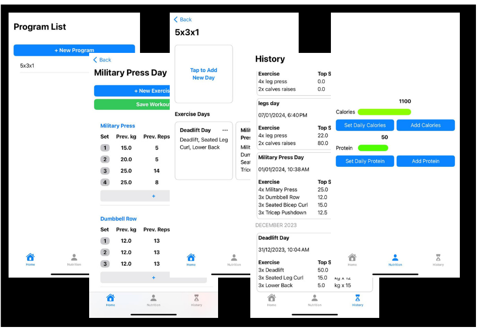

<h2>Introduction</h2>

This is a follow-up post to my previous post on Swift and one line of code a day. So for the entirety of December, I coded almost everyday (29/31) for at least 15 minutes, and at most a few hours. I attempted to build an app that I can use to track my workouts and the numbers I am lifiting at the gym. So, you can say its a complex to-do list app / hello-world app. I am quite pleased with the results and with what I've learned.

<h2>Swift and SwiftUI</h2>

I must say Apple did a good job with Swift. The language is rich in features without feeling bloated. It is quite fun to use and the philosophy behind it is good. Their tutorials on the language are also very good and provide a structured environment to learn everything you need to know.

SwiftUI is Apple's UI toolkit to build iOS apps. It is declarative and is also really good in my opinion. It seems to be a lot newer than some older counter-parts, so I am not sure exactly how widely it is being used in real-world development. But, knowing Apple, they will continue to support it until it is the default and I assume all new projects start with SwiftUI instead of older toolkits. I'd say I am pretty good at SwiftUI now after using it for a month straight.

In addition, I learned how to integrate SQL within an iOS app, which was as simple as expected.

<h2>Results</h2>

Here is how the app looks like, you can tell I am not exactly a graphic designer. It functions really well though which is all I care about at this stage.

Finally, I leave you wtih a link to the full source code.

[Github](https://github.com/Meryx/GymTracker)
